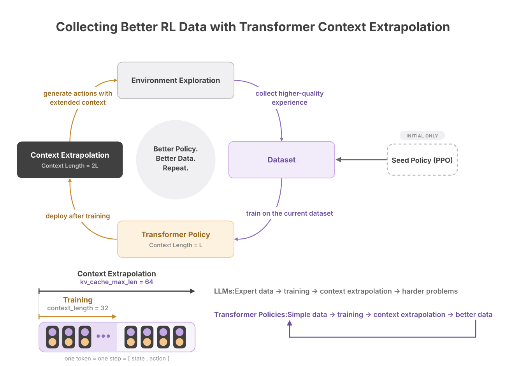

# Improving the Next Dataset

*Optional, and beside the packaging path.* [The path](README.md) ends at a
dataset. This is what the dataset you just built can be used for, if you intend
to collect again — and the one recorder this directory ships, for the one policy
source it can integrate with.

## The cycle

A packaged dataset trains a policy. That policy, run with more history retained
than it was trained on, acts in the environment and records the experience that
becomes the next dataset. A seed policy — SB3's PPO, a scripted controller,
whatever already drives your system — is needed only for the first turn of the
cycle.



This closes the one gap the [entry table](README.md#where-you-join) leaves
open. Entry point 1 has an environment and still owes you a policy model; after
a cycle you have one, and it is what the previous dataset produced.

## Where the gain is

The cycle turns on running the trained policy with more retained history than
its trained window — `kv_cache_max_len` above `context_length`. What that buys
is a step up in the *tier* of what you record: simple trajectories train a
policy that, deployed at a longer context, records the next dataset at medium.
The simple-to-medium crossing is where extrapolation pays, and it is what makes
a second collection run worth doing at all.

It is not a knob that keeps paying, though, and the closest published evidence
is a different measurement — an inference-time retention sweep over bundles
already trained across simple and medium, where doubling the window helps some
environments and hurts others (`Humanoid-v5` improves, `HumanoidStandup-v5`
falls, on the [model card](https://huggingface.co/ccnets/causal-gpt-rl)). So
measure the retention you mean to record at, in your own environment, before
spending a collection run on it.

## The code path

`CollectionRunner` wraps the `PolicyRunner` a bundle loads into and writes the
episodes it drives, so the policy this cycle produced records the next dataset
straight into [the input contract](01-the-input-contract.md).

```python
from causal_gpt_rl.inference import load_runner
from collection import CollectionRunner

runner = CollectionRunner(
    load_runner("bundle/", kv_cache_max_len=256),   # the retention you measured
    "raw/",
    bundle="bundle/",                                # kept as provenance
)

for episode in range(100):
    obs, _ = env.reset(seed=episode)
    runner.reset(obs, record=True)
    done = False
    while not done:
        action = runner.act()
        obs, reward, terminated, truncated, _ = env.step(action)
        done = terminated or truncated
        runner.observe(obs, reward, terminated, truncated)
```

Against the [rollout loop](../../docs/spaces.md#running-a-rollout) that same
runner is documented with, the difference is the constructor line, four
arguments, and the disappearance of the `if not done` guard. That guard is the
one place the two conventions disagree: the runner has no use for the final
observation, the contract needs it to reach `T + 1`. Inside the wrapper the
split is invisible — that observation is recorded, not fed.

The action written for a step is the one `act()` returned for the state it saw,
so the policy the dataset names is the policy that produced it. Perturbing an
action between `act()` and `env.step` breaks exactly that: the model feeds its
own decoded action back into its context, so the environment would run one
policy while the file records another. Vary [retention](#where-the-gain-is)
instead — it is the parameter this cycle turns on.

### What it writes

A directory [Packaging](03-packaging.md) takes as-is: one `ep_%06d.npz` per
episode, and a `spec.json` whose spaces are read off the bundle's own declared
`observation_space` / `action_space`. Each episode is checked against the
contract before it is written, so a recording run cannot end in a directory the
packager will refuse.

`spec.json` also carries a `provenance` entry per recording run — the bundle
identity you passed, `context_length`, `kv_cache_max_len` and `bos_cache_mode`.
The packager ignores keys it does not know; without them nothing afterwards can
say which policy, at which retention, produced the episodes.

### A batch of environments

A runner loaded with `num_envs > 1` records the same files from a vectorized
env, one episode per row:

```python
runner = CollectionRunner(
    load_runner("bundle/", num_envs=8), "raw/", episodes_per_row=1
)

observations, _ = venv.reset(seed=list(range(8)))
runner.reset(observations)
while not runner.all_rows_retired:
    actions = runner.act()
    observations, rewards, terms, truncs, _ = venv.step(actions)
    runner.observe(observations, rewards, terms, truncs)
runner.close()
```

Rows end at different steps, so each closes and writes on its own step and
`ep_%06d.npz` are numbered in the order they finish, not by row. Gymnasium's
vector auto-reset is `NEXT_STEP`: the step a row ends on carries its true final
observation and flags, and the *following* step carries the new episode's first
observation with a zero reward, no flags, and that row's action ignored. The
recorder owns that one-step wait — it closes the row on the first, and on the
second seeds a new episode without recording a transition, calling the runner's
`reset_rows` so the ended episode leaves the row's context before it does.

`episodes_per_row` is each row's share, and it is what makes the count exact. A
row that has written its share is *retired*: it keeps being driven, because the
batch is one forward and a single row cannot leave it, but nothing it does after
that reaches a file — including the flush `close()` performs. Stopping on a
total instead overshoots twice over, because rows whose episodes are short churn
through several while the long ones are still on their first, and whatever is in
flight when the total lands is written as a truncation. Recording eight rows
with a total of eight produced fourteen files that way, only four of them a
seeded episode that ran to termination.

The share is also what keeps seeds meaningful. A vector env is seeded once, at
`reset`, so only each row's **first** episode carries a seed the caller chose;
every later one is the env restarting itself, and where it goes depends on how
many steps the policy took before it — which is exactly what differs between two
runs being compared. `episodes_per_row=1` is therefore the form to record with
when the seeds have to line up across runs, and it makes `num_envs` the episode
count.

Nothing about the files changes: a batch is a faster way to fill a raw
directory, not a different kind of one. `spec.json`'s provenance records the
`num_envs` and `episodes_per_row` a run used.

### Boundaries

- **One environment keeps the single-env contract exactly**, auto-reset
  included: a closed episode ends the run and the next `reset()` starts the next
  one. A one-row vector env should use the loop above this section, not the
  batched one.
- **A single-env auto-resetting env must pass the true final observation.** When
  `env.step` already returns the next episode's first state, only the caller can
  still reach the real one. A batched run needs no such handling — `NEXT_STEP`
  hands the real one over on the step it belongs to.
- **`--max-steps` is the env's in a batch.** Only the environment can restart a
  row it truncates, so a per-episode cap has to ride in each sub-env's own
  `TimeLimit` (`gym.make_vec(..., max_episode_steps=...)`) rather than in the
  loop.
- **`record=False`** drives the policy without writing — warm-up episodes, or a
  loop that records only some of them.
- **Runnable forms.** [`examples/record_dataset.ipynb`](../../examples/record_dataset.ipynb)
  walks a Hub bundle through to a dataset read back;
  [`examples/deploy/record.py`](../../examples/deploy/record.py) is the same run
  as a script.
- **Anything else is your own loop.** This integrates with one policy source
  because that is the one whose interface we version; every other source has
  [the contract](01-the-input-contract.md) instead, which is what
  [Record Trajectories](02-record-trajectories.md) describes.
