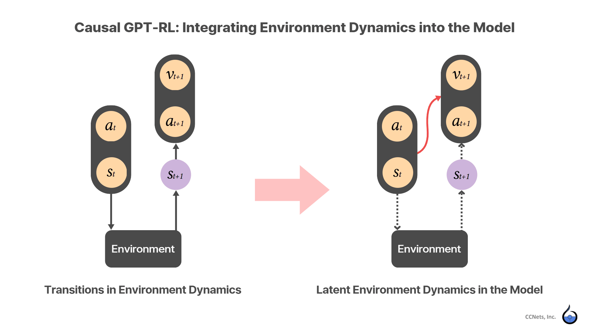

# Documentation

The runtime references for `causal-gpt-rl` — what the policy is, what it accepts
and returns, and how to call it.

| Document | What it answers |
|---|---|
| [Transformer Model Integrating Environment Dynamics for RL](environment-dynamics-in-transformer.md) | Why the emitted action is one step ahead of the observation you just passed, why actions keep coming with no environment attached, and what the context window governs. **Read this first.** |
| [Observation & Action Spaces](spaces.md) | Which Gymnasium spaces a bundle can declare, what you pass, and what you get back. |
| [API Reference](api.md) | Signatures, parameters, return values, and the exceptions each call raises. |
| [Measuring a Long Horizon](long-horizon.md) | What to report once a rollout is long enough that a return mean averages early failures and full-length runs into a number describing neither. |
| [Export a delivered bundle to ONNX](export-onnx.md) | Turning a bundle into a self-contained ONNX policy, including fixed-batch multi-agent use. |

Installation, published policies and their scores, and the bundle format are in
the [repository README](../README.md). Worked runs — quickstart, MuJoCo, and the
Unity walkthroughs — are in [examples/](../examples/README.md).
