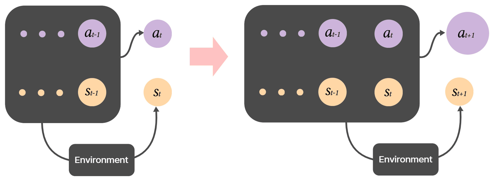
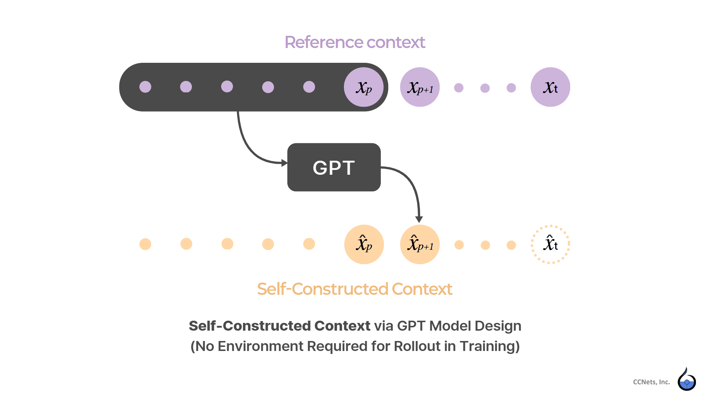
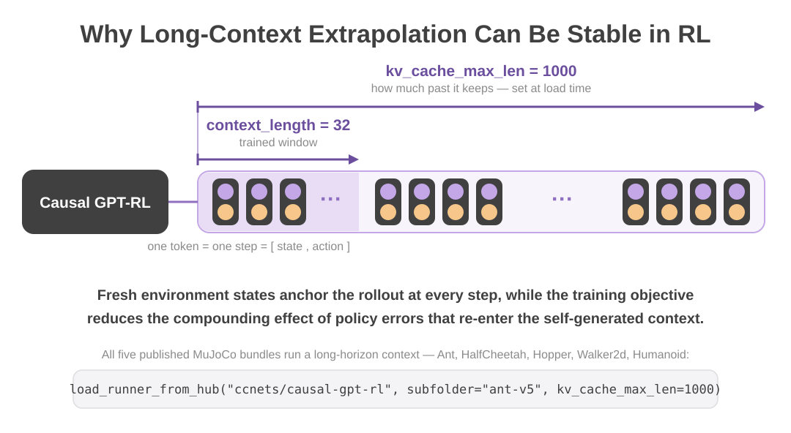

# Transformer Model Integrating Environment Dynamics for RL

*How an RL policy changes once the environment step lives inside the model.*

Whichever family you come from — PPO or SAC, on-policy or off-policy, online or
offline — the loop has the same shape: the policy maps the current state to an
action, the environment returns the next state and a reward, and only then is the
next action chosen.

```text
conventional RL — transitions in environment dynamics
    (state, action) → environment → (next state, reward) → (next action, next value)

        ↓  the middle step folds into the model

Causal GPT-RL — latent environment dynamics in the model
    (state, action) → (next action, next value)
```

The model reads a state together with the action taken in it, and emits the next
action — and the value that goes with it — directly. There is no next-state
output, and nothing in the calling contract asks you to supply one. What you
pass each step is an observation; the runtime pairs it with the action the model
itself last produced, and that pair — not the state alone — is what the model
reads, the way a language model reads a token.



As a calling contract, two things differ from what you are used to:

- **the output is one step ahead.** The head reads `(s_t, a_t)` and speaks about
  `t+1`, so what comes back is the action for the step about to be taken — not a
  reaction to the observation you just sent;
- **the action is drawn the way a language model draws a token** — and it
  re-enters the context as history on its own. You never feed it back yourself.

So the head sitting on the token at time `t` does **not** describe time `t`:

| The head emits | Meaning |
|---|---|
| `a_{t+1}` | the action to take at the next step |
| `V_{t+1}` | the value of that next step, emitted alongside |

A pair goes in, but a pair does not come out. The only half the model produces
is the action; the state half of the next token is supplied by the world, and
the two are joined into the next input token — **action generated, state
given.** (The token carries one further field, a flag marking the first token of
an episode, which the runtime sets on `reset`.) The value that arrives with an
action describes the step you are about to take, not the one you have just
taken.

Two consequences follow immediately, and both read as bugs to anyone holding a
state-to-action policy in mind: the observation you have just handed in does not
change the action that comes back on that call, and actions keep arriving even
with no environment attached at all. Neither is a defect, and the rest of this
document is those two facts spelled out.

## Self-constructed context — no environment required for rollout

In RL that needs an environment, taking one more step requires the next state,
and only the environment can produce it. Detach the environment and the rollout
stops right there: the policy has no way to make its own next input. That is the
constraint everything else has been built around.

Here the action takes that place. A token is only complete once its action
exists. When you hand the runtime a fresh observation, it cannot yet form a
token from it — no action has been
chosen for that state. The observation is therefore held aside, the model emits
the next action from the history it already has, and only then are the two
joined into a token that enters the context. That is why the observation you
just passed does not move the answer on that same call.

Which is also why **the model does not need `s_{t+1}` in order to keep producing
actions.** Given a context it carries an action sequence forward on its own — a
self-constructed context, built out of its own outputs, the way a language model
continues a sentence. A bundle alone can therefore reconstruct trajectories over
an offline dataset, with nothing else installed; the runtime's episode loop,
when an environment is present, is
only the version of that generation in which each step is re-anchored by a real
observation. No simulator has to be standing for a rollout to come out. It is
also why the API (`reset` / `act` / `observe`) feeds the model's own emitted
action back into the context and gives you no way to inject someone else's: the
loop is closed on purpose, and the action that re-enters has to be the one the
model actually produced.



The same self-construction is what makes the training side work without a
simulator. Offline RL normally means learning from a recorded log and nothing
else, because producing new experience would require an environment to step
through. Here the rollout comes out of the model itself, over your recorded
data, so the policy can be trained on continuations it generated — closer in
spirit to tuning a language model on its own generations than to replaying a
log. Your dataset, no simulator, at training time as much as at inference.

## The trained window is not a ceiling

In a language model the context window is working memory, and the window used in
training is not the limit at inference — running the same weights over a longer
context is familiar territory there. The same holds here, except that a token is
a state–action pair rather than a word, so the length of the window is simply
**how many steps are remembered**.

History is not resent on every call. The context stays in the KV cache and a
step processes a single token, which makes this runtime a session rather than a
sequence of requests — the same observations handed over in a different order
produce a different result. The order you give is the order of time.

Two different numbers govern length here:

| Value | What it is | Can you set it? |
|---|---|---|
| `context_length` | the trained token window (32 in the published bundles) | **No** — fixed in the bundle |
| `kv_cache_max_len` | how much past the rollout actually retains, in tokens | **Yes** — at load time; defaults to `context_length`. Larger values run, but pay off only where the policy generalizes past its trained window |



The purpose of that knob is not performance tuning; it is **drift control over
long rollouts**. A policy conditioning on its own outputs rides on the history
it has been building, and how much of that history it carries is what governs
the ride. The evidence is plain enough — weights trained on a 32-token window
carry an episode through to the end with a 1000-step KV cache. The weights are
unchanged; the only thing that grew is the amount of past carried along.
