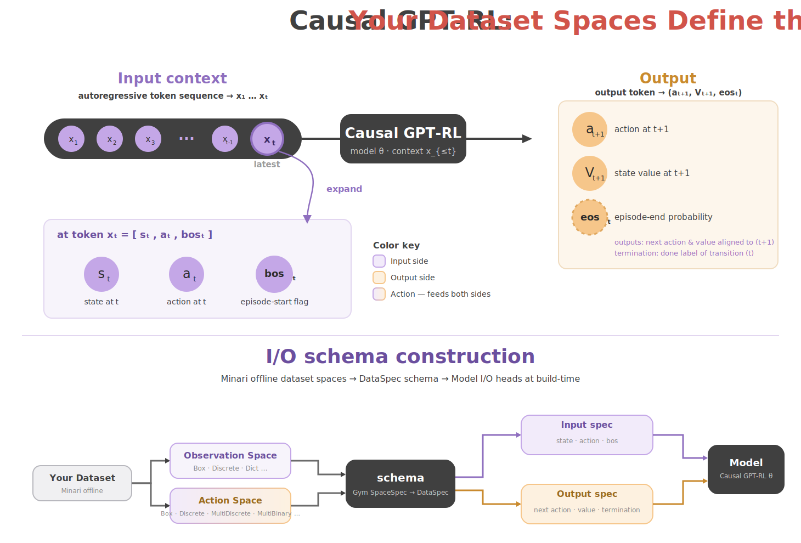

# Training

This directory contains hosted-training input definitions and notes for AWS
Marketplace/SageMaker training paths.

The local trainer implementation is not part of this repository.

## How it fits together

Your dataset's observation and action spaces define the model's I/O schema: the
same spaces are turned into a `DataSpec` schema at build-time, which fixes the
autoregressive token layout the model consumes and produces at inference.



## Hyperparameters

`hyperparameters.py` contains the training job payload schema. Hosted-training
quickstarts should import it instead of duplicating the field list:

```python
from training import Hyperparameters

hp = Hyperparameters()
hp.set_config(
    dataset_ids=["mujoco/humanoid/simple-v0"],
    max_steps=100_000,
)

training_hyperparameters = hp.to_dict()
```

## AWS/SageMaker Docs

AWS Marketplace/SageMaker training notes live under `training/docs/aws/`:

- `training/docs/aws/aws-marketplace-training.md`
- `training/docs/aws/sagemaker-input-datasets.md`
- `training/docs/aws/sagemaker-hyperparameters.md`
- `training/docs/aws/sagemaker-output-artifacts.md`
- `training/docs/aws/sagemaker-checkpoints.md`
- `training/docs/aws/sagemaker-retraining.md`

## Hosted Training Status

AWS Marketplace/SageMaker training entrypoints are being prepared but are not
live public products yet. Until they are published, keep listing links, pricing,
EULA text, and default SageMaker Algorithm ARNs out of public examples.

When the hosted path is ready, its quickstart should use this interface to
submit training hyperparameters, then load the exported bundle with the runtime
inference APIs.
