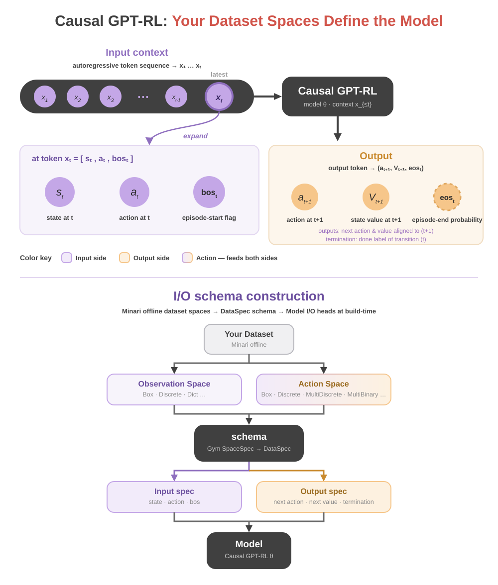

# Training

This directory contains hosted-training input definitions and notes for AWS
Marketplace/SageMaker training paths.

The local trainer implementation is not part of this repository.

## How it fits together

Your dataset's observation and action spaces define the model's I/O schema: the
same spaces are turned into a `DataSpec` schema at build-time, which fixes the
autoregressive token layout the model consumes and produces at inference.



## Hyperparameters

`hyperparameters.py` contains the training job payload schema. Hosted-training
quickstarts should import it instead of duplicating the field list:

```python
from training import Hyperparameters

hp = Hyperparameters()
hp.set_config(
    dataset_ids=["mujoco/humanoid/simple-v0"],
    max_steps=100_000,
)

training_hyperparameters = hp.to_dict()
```

## Journey

A four-part read on what the product is and how you steer it, in order. Start
here if you are new to Causal GPT-RL; the AWS docs below assume you know what a
bundle is and what its spaces mean.

1. [Bring Your Own Data](docs/journey/01-bring-your-own-data.md) — a GPT-shaped
   policy trained small on your recorded data, and the spaces you declare for it
2. [The Acting Policy](docs/journey/02-the-acting-policy.md) — how the model
   runs: load a bundle and roll it out
3. [Shaping Behavior Through State](docs/journey/03-shaping-behavior-through-state.md)
   — steering what the policy does by what you put in its state
4. [A Policy You Can Prompt](docs/journey/04-a-policy-you-can-prompt.md) — that
   same channel expressed in natural language

## AWS/SageMaker Docs

[`training/docs/aws/`](docs/aws/README.md) covers the managed path end to end —
running a job, the dataset channel and hyperparameters, delivered bundles and
the output artifact, the checkpoint-selection metric, and resuming a run. It
opens with the diagram of what crosses to hosted training and what comes back.

## Hosted Training

Hosted training is available on AWS Marketplace as the CCNets Causal GPT-RL
Training Algorithm:

https://aws.amazon.com/marketplace/pp/prodview-is6jt3bcwkq5c

Subscribe there, then follow `training/docs/aws/aws-marketplace-training.md`.
Take the Algorithm ARN from the listing rather than hard-coding one here, and
keep pricing and EULA text out of this repository — the listing is the only
place those are current.
