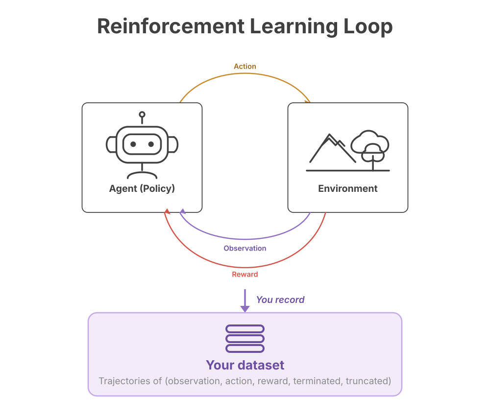

# Training Docs

Start from the loop you already know.

That loop is where your data comes from. In offline RL the agent in it is yours
— a scripted policy, a prior model, a human operator — and ours is trained
afterwards, from the dataset it produced.

| | |
|---|---|
| [journey/](journey/README.md) | What the product is and how you steer it — four parts, no AWS required |
| [aws/](aws/README.md) | Running it as a managed job on AWS Marketplace / SageMaker |

Diagrams live in [assets/](assets/).
