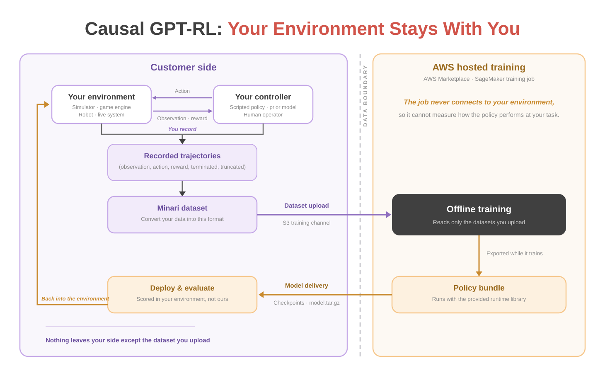

# AWS Marketplace / SageMaker

Running Causal GPT-RL training as a managed job: what you hand over, what the
job gives back, and how to continue from it.

Only the dataset you upload crosses to hosted training. What comes back is
yours to run, and to continue training from.

| Document | What it answers |
|---|---|
| [Running a job](aws-marketplace-training.md) | Launching a training job after subscribing, and reading its logs and metrics. **Start here.** |
| [Training inputs](sagemaker-inputs.md) | The dataset channel and every hyperparameter — what the job adjusts for you, and what it refuses to start with. |
| [Checkpoints and bundles](sagemaker-checkpoints.md) | The bundles delivered while the job runs, and what the final artifact contains. |
| [Checkpoint Score](checkpoint-score.md) | The metric that picks the canonical bundle — and what it does not tell you. |
| [Retraining](sagemaker-retraining.md) | Resuming a run, and branching from a preserved step. |

These docs assume you know what a bundle is and what its spaces mean. If you do
not, read the [journey series](../journey/README.md) first.
