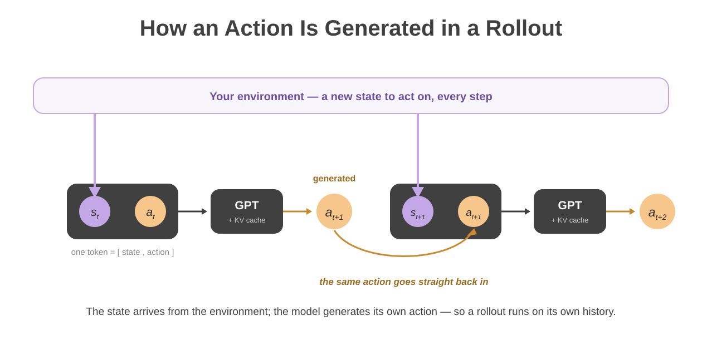

# Journey

A four-part read on what Causal GPT-RL is and how you steer it, in order. Start
here if you are new.

The loop in [the docs index](../README.md) is the one every RL system shares.
This is where ours departs from it: the action does not merely leave the model,
it stays — re-entering as the next input, so one model carries a whole episode.

1. [Bring Your Own Data](01-bring-your-own-data.md) — a GPT-shaped policy
   trained small on your recorded data, and the spaces you declare for it
2. [The Acting Policy](02-the-acting-policy.md) — how the model runs: load a
   bundle and roll it out
3. [Shaping Behavior Through State](03-shaping-behavior-through-state.md) —
   steering what the policy does by what you put in its state
4. [A Policy You Can Prompt](04-a-policy-you-can-prompt.md) — that same channel
   expressed in natural language

Parts 1–3 are enough for most control, game, and app problems.
